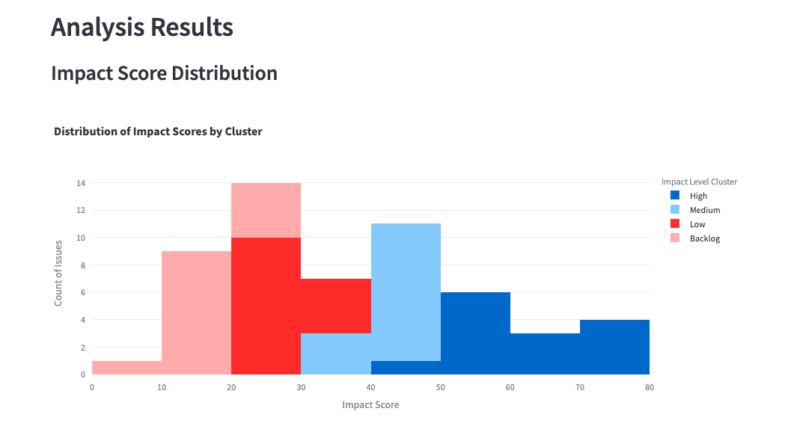
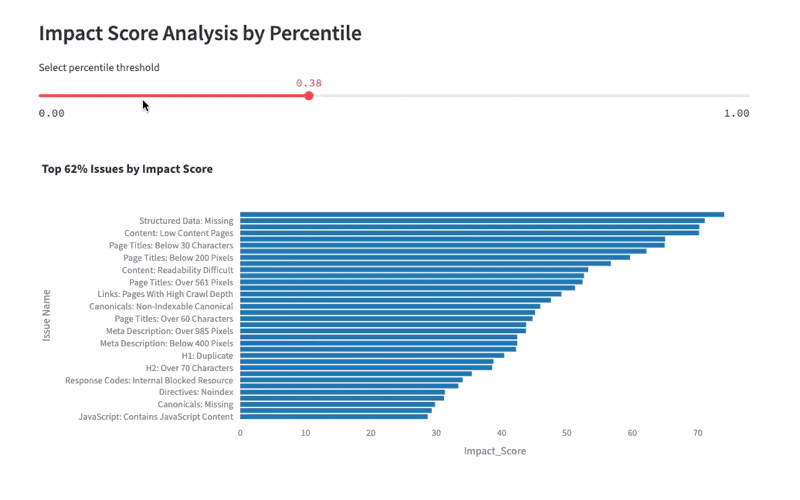
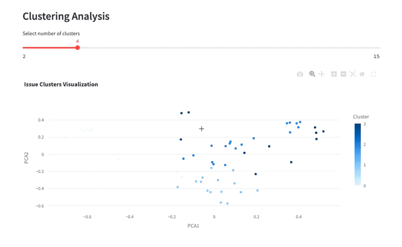
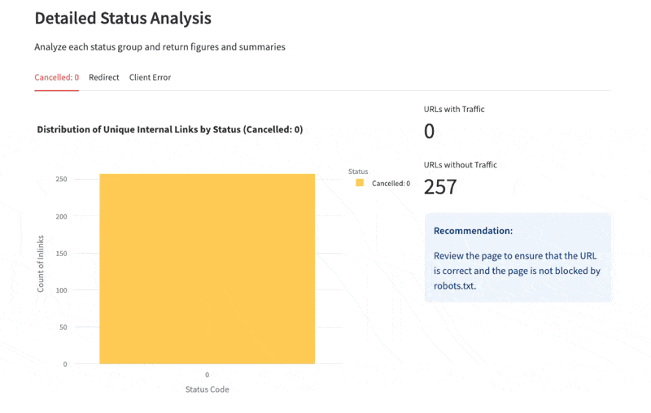

# Screaming Frog Technical Audit Prioritizer

A Streamlit application that helps SEO professionals prioritize technical issues discovered through Screaming Frog crawls by analyzing factors like organic traffic impact, issue severity, and scale.

[](https://screaming-frog-seo-audit-organizer.streamlit.app/)
## 🎯 Features

### Impact Score Analysis
Understand the distribution and severity of technical issues across your site:



### Prioritized Issues View
Visualize your most critical technical issues ranked by impact:



### Semantic Clustering
Group similar issues together for more efficient handling:



### Status Code Analysis
Analyze internal linking patterns and HTTP status codes:



## 📋 Prerequisites

- Python 3.8+
- Screaming Frog SEO Spider
- Google Search Console access (for traffic data)

## 🚀 Installation

1. Clone the repository:
```bash
git clone https://github.com/tylergargula/screaming-frog-audit-organizer.git
cd screaming-frog-audit-organizer
```

2. Install the required packages:
```bash
pip install -r requirements.txt
```

3. Run the application:
```bash
streamlit run app.py
```

4. Upload you exported files from Screaming Frog and Google Search Console.
5. Analyze and prioritize your technical SEO issues.

## 🛠️ Technical Architecture
```bash
sscreaming-frog-audit-organizer/
├── src/
│   ├── init.py
│   ├── data/
│   │   ├── init.py
│   │   ├── cleaning.py
│   │   └── scoring.py
│   ├── utils/
│   │   ├── init.py
│   │   ├── embeddings.py
│   │   └── export.py
│   └── visualization/
│       ├── init.py
│       ├── clustering.py
│       └── plotting.py
├── streamlit/
│   └── app.py
└── media/             # Documentation assets

```

## 👤 Author
- **Tyler Gargula** - [LinkedIn](https://www.linkedin.com/in/tylergargula/) | [tylergargula.dev](https://tylergargula.dev/)